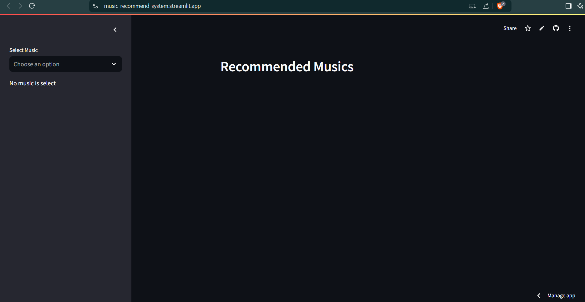
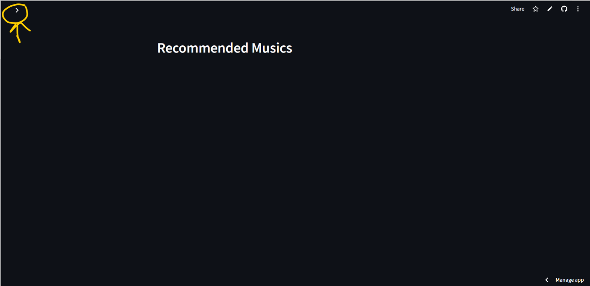
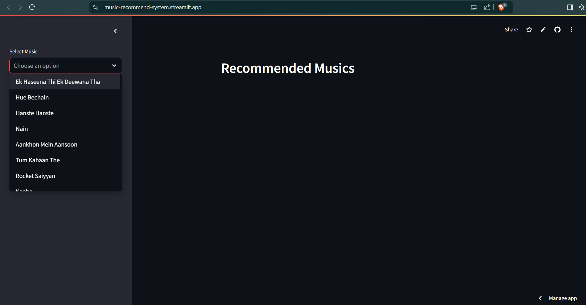
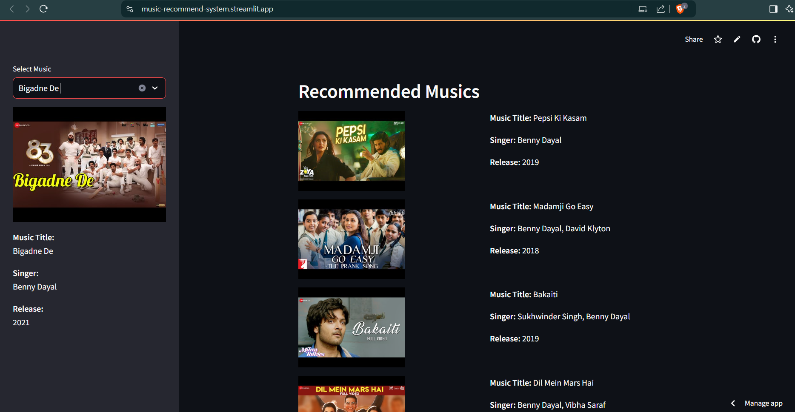

# **🎵 Youtube Bollywood Music Recommend System 🎵**

## **About the Project**
This is a `content-based` recommendation system that suggests Bollywood songs on YouTube. It analyzes song attributes like artist, release year, and lyrics to recommend songs based on the user's preferences. This system does not use collaborative filtering but rather focuses only on the characteristics of the songs and user inputs, making it suitable for personalized recommendations without using user-to-user data.

## **Objective of the Project**
The primary goal of the YouTube Bollywood Song Recommendation System is to develop a personalized and efficient song recommendation solution based on content-based filtering techniques. It aims at:

- **Enhancing User Experience:** To provide the user with a list of curated Bollywood songs that fit his or her preferences in terms of genre, mood, or favorite artists.
- **Simplifying Song Discovery:** To enable users to find new songs or revisit some lesser-known tracks based on their specific tastes.
- **Demonstrate Content-Based Filtering:** Demonstrate how accurate and personalized suggestions can be generated using content-based recommendation algorithms.
- **Provide Scalable Recommendations:** Design a scalable system that can handle the large song dataset and ensure efficient recommendations to a large range of users.

This project bridges the gap between Bollywood music enthusiasts and their favorite content on YouTube, thus improving music discovery through intelligent recommendations.

## **Technology Used**
- **Natural Language Toolkit:** To process text.
- **Cosine Similarity:** For recommendation.
- **Streamlit:** To build the web app.
- **Streamlit Cloud:** To host the web app.

## **Links**
- **Dataset:** https://github.com/devensinghbhagtani/Bollywood-Songs-Dataset/blob/main/Bollywood-Songs-Dataset(2017-23).csv
- **Web App:** https://music-recommend-system.streamlit.app/

## **How to run the app?**
- Click on: https://music-recommend-system.streamlit.app/

- The app will open in your default browser.

  **Note:**
  If your interface look like the following, click on the arrow to open the sidebar.

  

- Provide your input to the select box on the left sidebar.

- You will get the recommendation based on your selection.

